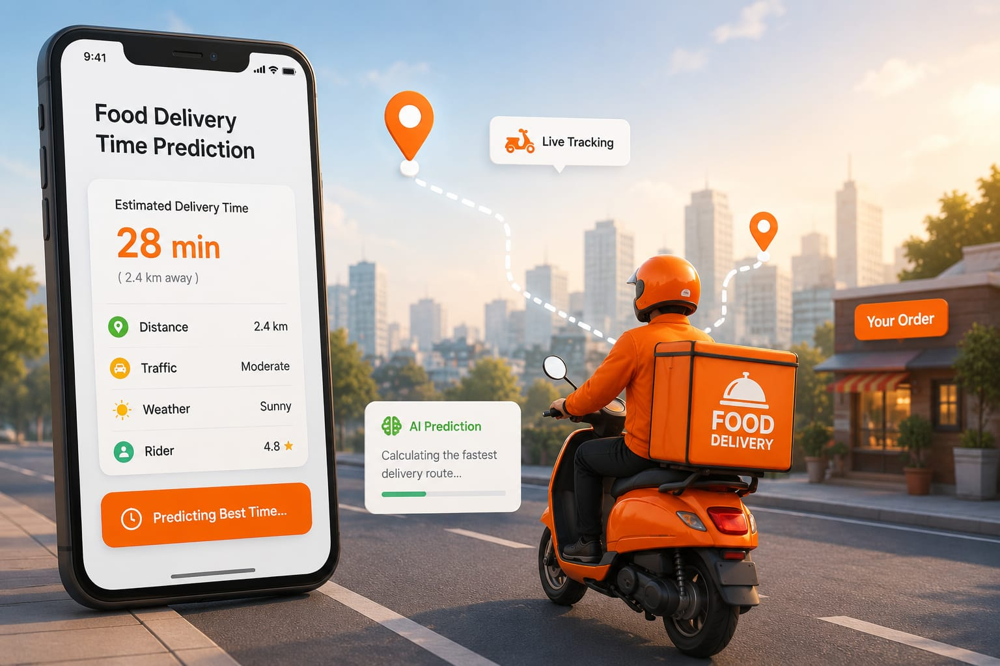

# Food Delivery Time Prediction Model 🚚🍔

---



---


## **Project Overview**
This project focuses on developing a Machine Learning model to predict food delivery time accurately. The main objective is to estimate how long an order will take to reach customers based on various factors such as order details, delivery location, weather conditions, traffic, and delivery partner information.

Accurate delivery time prediction helps improve customer satisfaction, optimize logistics, and enhance operational efficiency for food delivery platforms.

---

## **Dataset Information**
The dataset contains important information such as:

- Order details
- Delivery location
- City information
- Delivery partner details
- Weather conditions
- Traffic conditions
- Order and pickup timings
- Actual delivery time

---

## **Live Demo**

Web App Link: https://food-delivery-time-prediction-zpw5cvopdcgfrfujohs3kv.streamlit.app/

---

## **Project Workflow**

### Data Collection
Collected the food delivery dataset and explored the data structure.

### Data Cleaning
Performed preprocessing to handle:

- Missing values
- Incorrect data entries
- Duplicate values
- Data inconsistencies

### Feature Engineering
Created meaningful features from existing variables:

- Time-based features
- Distance calculations
- Delivery-related attributes
- Encoded categorical variables

### Exploratory Data Analysis (EDA)
Performed detailed EDA to identify:

- Delivery patterns
- Correlations
- Outliers
- Important features

### Model Development
Trained and compared multiple regression models:

- Linear Regression
- Decision Tree Regressor
- Random Forest Regressor
- XGBoost Regressor

### Model Evaluation
Models were evaluated using:

- Mean Squared Error (MSE)
- Root Mean Squared Error (RMSE)
- R² Score

---

## Best Model Performance 📈

The best-performing model was **XGBoost Regressor**

**R² Score: 0.76**

---

## **Technologies Used**

- Python
- Jupyter Notebook
- Streamlit
- GitHub

---

## **Python Libraries Used**

- Pandas
- NumPy
- Scikit-learn
- Matplotlib
- Seaborn
- XGBoost
- Streamlit

---

## **Project Structure**

```text
Food-Delivery-Time-Prediction/
│
├── notebook/
├── App/
├── models/
├── requirements.txt
├── runtime.txt
├── README.md